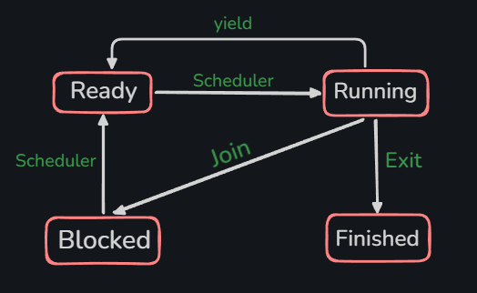

## UTHREAD Design

#### 1. uthread_create()
```C
    int uthread_create
    (
        uthread_t *thread, void* (*func)(void *), void* arg, int stack_size
    );
```
- On successful returns '0' else returns '-1'. 
- if malloc fails to allocate stack, returns -1 with error msg.
- stack size is allocated by size of function + extra bytes when stack_size is passed 0. 

#### 2. uthread_yield()
- A running thread calls another thread to run. Thread which calls `yield` goes back in queue. 
- Only a running thread can call this function. Blocked or Ready threads cannot.
```C
    void uthread_yield();
```

#### 3. uthread_exit()
```C
    void uthread_exit(void *retval);
```
- this is retval fetches value returned by terminating thread. 
- retval is used by other threads calling uthread_join().

#### 4. uthread_join()
```C
    int uthread_join(uthread_t thread_observed, void **retval);
```
- used by another thread to wait for the target thread.
- target thread could be running, blocked, or ready. 
- retval tells what to expect return value from the running thread when it terminates.
- join on finished thread immediatly returns, while join twice on same thread makes the scheduler take the decision based on priority. 

#### 5. uthread_self()
```C
    uthread_t uthread_self(void); 
```
- returns currently running thread's data.

<br>



<br>

## Thread Control Block (TCB)

#### Sates : 
1. Running : when the thread is actually being executed. 
2. Ready : when the thread is waiting in queue to run
3. Blocked : Thread has been paused, it could be waiting for another thread to join.
4. Finished : Finished execution, retval has not been returned.

- If Thread-A has called join() on Thread-B then Thread A is called 'joiner' and Thread-B is called 'target'. 
- it is joiner's responsibility to free the stack of target thread once target thread is finished. 
- Before erasing the target, joiner should first save the retval of target. 
